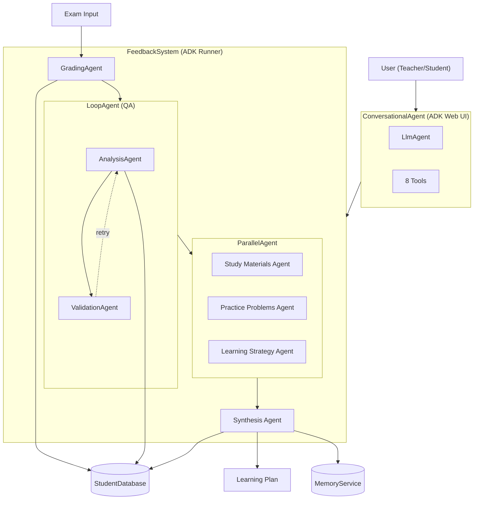

# LearnPath Agent

LearnPath Agent automates the entire exam feedback lifecycle, from grading and weakness analysis to personalized learning path generation.



## Project Overview - LearnPath Agent

This project contains the core logic for LearnPath Agent, a multi-agent system designed to automate exam grading, identify conceptual weaknesses, and generate personalized learning recommendations. The agent is built using Google Agent Development Kit (ADK) and follows a modular architecture combining sequential, parallel, and loop agent patterns.

---

## Problem Statement

Grading exams manually is laborious because it requires significant time investment in evaluating each student's responses, identifying patterns of misunderstanding, and crafting meaningful feedback. The repetitive nature of grading similar mistakes across multiple students can quickly become mentally exhausting and reduces the quality of feedback provided.

Manual exam grading also struggles to scale when class sizes increase, forcing educators to choose between thorough feedback and timely results. Generic feedback like "incorrect" or "review this topic" fails to identify the underlying conceptual gaps that led to wrong answers. Students receive surface-level corrections without understanding *why* they made mistakes or *how* to improve.

Furthermore, teachers lack visibility into patterns across their entire class—they may not realize that 80% of students struggle with the same concept until they've manually reviewed every exam.

---

## Solution Statement

Agents can automatically grade exams by comparing student responses against answer keys, calculating scores, and providing detailed per-question feedback—reducing grading time from hours to minutes. They can identify **conceptual weaknesses** rather than just marking answers wrong, extracting topics like "Newton's Second Law" instead of simply flagging question text.

Additionally, agents can generate personalized learning recommendations by running multiple specialized sub-agents in parallel: one curating study materials, another generating practice problems, and a third developing learning strategies. This parallel architecture ensures comprehensive recommendations without sacrificing speed.

The system also provides role-based access control (students see only their own data, teachers see all students) and cross-session memory to track learning progress over time—transforming exam feedback from a manual chore into a data-driven, personalized learning experience.

---

## Architecture

Core to LearnPath Agent is the `FeedbackSystem`—a prime example of a multi-agent system. It's not a monolithic application but an ecosystem of specialized agents, each contributing to a different stage of the exam feedback process. This modular approach, facilitated by Google's Agent Development Kit, allows for a sophisticated and robust workflow. The central orchestrator of this system is the `FeedbackSystem` class using the ADK Runner pattern.

The `FeedbackSystem` is constructed using the ADK `Runner` class with a `SequentialAgent` pipeline. Its definition highlights several key components: the session service for persistence (`DatabaseSessionService`), custom plugins for observability (`ExamMetricsPlugin`), and a detailed pipeline of specialized agents. Crucially, it defines the agent pipeline it orchestrates and the callbacks that persist results to the database.

```python
# Core pipeline structure
SequentialAgent(
    name="feedback_pipeline",
    sub_agents=[
        grading_agent,           # Stage 1: Grade the exam
        analysis_loop_agent,     # Stage 2: Analyze weaknesses with QA
        parallel_recommendations, # Stage 3: Generate recommendations in parallel
        synthesis_agent          # Stage 4: Create unified learning plan
    ]
)
```

The real power of LearnPath Agent lies in its team of specialized sub-agents, each an expert in its domain.

---

### Grader: `GradingAgent`

This agent is responsible for scoring exams against answer keys and providing detailed feedback. It compares each student response to the expected answer, calculates scores, and generates per-question corrections.

The `GradingAgent` outputs to the state key `grading_result`, which contains:
- Total score and maximum possible score
- Per-question breakdown (correct/incorrect)
- Detailed feedback for wrong answers
- Overall performance summary

```python
grading_agent = LlmAgent(
    name="grading_agent",
    instruction="""Grade the exam: {exam_content}
    Against answer key: {answer_key}
    Return structured JSON with scores and corrections.""",
    output_key="grading_result"
)
```

---

### Analyst: `AnalysisAgent` + `ValidationAgent` (LoopAgent)

Once grading is complete, the `AnalysisAgent` takes over. This agent identifies **conceptual weaknesses**—not just wrong answers. The critical innovation here is extracting topic names like "Quadratic Equations" rather than question text like "Solve x² + 5x + 6 = 0".

To ensure high-quality output, it's implemented as a `LoopAgent`, a pattern that allows for retries and validation. The `ValidationAgent` ensures that the generated analysis meets predefined quality standards:

- `topics` field exists and is non-empty (all concepts tested, not just weaknesses)
- Weaknesses contain concept names, not question text
- Summary is substantive (>20 characters)

If validation fails, the loop retries (up to 5 iterations) with feedback to improve the output.

```python
class ValidationAgent(BaseAgent):
    """Quality checker for analysis output."""

    async def _run_async_impl(self, ctx):
        analysis = ctx.session.state.get("weakness_analysis", {})

        # Validate topics field
        if not analysis.get("topics"):
            return  # Causes retry

        # Validate weakness structure
        for weakness in analysis.get("weaknesses", []):
            if looks_like_question_text(weakness.get("topic")):
                return  # Causes retry

        # Validation passed - escalate to proceed
        yield Event(actions=EventActions(escalate=True))
```

---

### Recommenders: `ParallelAgent` (3 Specialized Agents)

To maximize the quality and breadth of recommendations, LearnPath Agent uses a `ParallelAgent` that runs three specialized sub-agents simultaneously:

**Study Materials Agent**
- Curates relevant learning resources
- Recommends textbooks, videos, articles
- Matches resources to identified weaknesses

**Practice Problems Agent**
- Generates targeted practice exercises
- Creates problems addressing specific weak concepts
- Provides varying difficulty levels

**Learning Strategy Agent**
- Develops personalized study techniques
- Suggests time management approaches
- Recommends review schedules

Running these in parallel ensures comprehensive recommendations without sacrificing speed—all three agents work simultaneously rather than sequentially.

```python
parallel_recommendations = ParallelAgent(
    name="parallel_recommendations",
    sub_agents=[
        study_materials_agent,
        practice_problems_agent,
        learning_strategy_agent
    ]
)
```

---

### Synthesizer: `SynthesisAgent`

The `SynthesisAgent` combines the outputs from all three parallel recommendation agents into a unified, coherent learning plan. This agent is an expert at creating actionable study plans that integrate:

- Learning objectives derived from weaknesses
- Weekly study schedule with specific resources
- Practice problem assignments
- Success metrics and milestones
- Encouraging messages to motivate the student

```python
synthesis_agent = LlmAgent(
    name="synthesis_agent",
    instruction="""Create a unified learning plan from:
    - Study materials: {study_materials}
    - Practice problems: {practice_problems}
    - Learning strategy: {learning_strategy}""",
    output_key="learning_plan"
)
```

---

## Essential Tools and Utilities

LearnPath Agent and its sub-agents are equipped with a variety of tools to perform their tasks effectively.

### Database Persistence (`StudentDatabase`)

A SQLite-based persistence layer that stores all exam data, analysis results, and recommendations. The database uses three core tables:

- `students`: Student registration and metadata
- `exams`: Exam submissions with scores and grading results
- `analysis`: Weakness analysis and learning recommendations

```python
class StudentDatabase:
    def log_exam(self, student_id, exam_id, score, grading_result): ...
    def log_analysis(self, exam_id, weaknesses, topics, recommendations): ...
    def get_student_history(self, student_id): ...
```

### Authorization Tools

Role-based access control tools using the ADK `ToolContext` pattern. The system supports three roles:

- **STUDENT**: Can view only their own exam results and recommendations
- **TEACHER**: Can view all students' data and class statistics
- **ADMIN**: Full system access

```python
@tool
def get_my_performance(ctx: ToolContext) -> dict:
    """Students can only see their own data."""
    user_id = ctx.state.get("user_id")
    return database.get_student_history(user_id)

@tool
def get_class_statistics(ctx: ToolContext) -> dict:
    """Teachers can see aggregate class data."""
    if ctx.state.get("role") != "TEACHER":
        raise PermissionError("Teachers only")
    return database.get_all_statistics()
```

### Image Processing (`ImageProcessingAgent`)

This tool is crucial for processing image-based exams. It uses Gemini's vision capabilities to extract structured content from photos of handwritten or printed exams:

- Supports PNG, JPEG, GIF, WebP formats
- Extracts exam questions, student answers, and answer keys
- Returns structured JSON ready for the grading pipeline

### Observability Plugin (`ExamMetricsPlugin`)

A custom `BasePlugin` implementation that tracks domain-specific metrics:

- **Processing times**: Per-agent and total pipeline duration
- **Score distributions**: Min, max, average across exams
- **Success/failure rates**: System health monitoring
- **JSONL output**: Each exam appends a line for easy log processing

```python
class ExamMetricsPlugin(BasePlugin):
    async def before_agent_callback(self, **kwargs):
        self.agent_start_time = time.time()

    async def after_agent_callback(self, **kwargs):
        duration = time.time() - self.agent_start_time
        self.metrics["agent_timings"].append({
            "agent": kwargs["agent_name"],
            "duration_ms": duration * 1000
        })
```

### Memory Service (`MemoryService`)

Cross-session tracking for long-term learning analytics:

- **Recurring Weaknesses**: Identifies concepts that appear across multiple exams
- **Learning Velocity**: Measures improvement rate per topic over time
- **Mastery Progress**: Tracks which subjects are improving vs. stagnating
- **Spaced Repetition**: Recommends topics for review based on recurrence

---

## Conversational Interface (ADK Web UI)

LearnPath Agent includes a conversational interface accessible via ADK Web UI. This provides a natural language interface for teachers and students to interact with the system.

### Starting the Interface

```bash
cd feedback_agent
adk web
```

Then open `http://localhost:8000` in your browser.

### Available Tools (8 Total)

The conversational agent exposes 8 tools for interacting with the FeedbackSystem:

| Tool | Role | Description |
|------|------|-------------|
| `authenticate_user` | All | Login with name and role (teacher/student) |
| `process_exam_from_image` | Teacher | Grade an exam from an uploaded image |
| `process_exam_from_text` | Teacher | Grade an exam from text content |
| `get_my_results` | All | View your own exam results |
| `get_student_results` | Teacher | View any student's exam results |
| `get_class_analytics` | Teacher | View class-wide statistics |
| `list_students` | Teacher | List all registered students |
| `get_learning_recommendations` | All | Get personalized learning recommendations |

### Image Upload Support

The conversational interface supports multiple image sources:

1. **ADK Web UI Upload**: Drag and drop images directly into the chat
2. **URL**: Provide a public URL to an image
3. **Local Path**: Provide a local file path (when running locally)

### Example Conversation

```
User: Hi, I'm Ms. Johnson, a teacher
Agent: [authenticates user as teacher]
       Welcome, Ms. Johnson! As a teacher, you can grade exams, view student results, and see class analytics.

User: [uploads exam image] Grade this exam for Alice in Mathematics
Agent: [processes image, extracts content, grades exam]
       Alice scored 8/10 (80%) on the Mathematics exam.

       Areas for Improvement:
       - Quadratic Equations (medium severity)
       - Factorization (low severity)

       I've generated a personalized learning plan for Alice.
```

---

## How to Use
Read the [HOW-TO-USE.md](./docs/HOW-TO-USE.md) for detailed instructions on setting up and using LearnPath Agent.

## Conclusion

The beauty of LearnPath Agent lies in its iterative and collaborative workflow. The `FeedbackSystem` acts as a project manager, coordinating the efforts of its specialized team. It orchestrates the grading pipeline, ensures quality through validation loops, parallelizes recommendations for efficiency, and synthesizes results into actionable learning plans.

This multi-agent coordination, powered by the Google ADK, results in a system that is:

- **Modular**: Each agent has a single responsibility
- **Reusable**: Agents can be recombined for different workflows
- **Scalable**: Parallel execution handles increasing load
- **Observable**: Custom plugins provide production-ready monitoring
- **Robust**: Loop agents with validation ensure output quality

LearnPath Agent is a compelling demonstration of how multi-agent systems, built with powerful frameworks like Google's Agent Development Kit, can tackle complex, real-world problems. By breaking down the process of exam feedback into a series of manageable tasks and assigning them to specialized agents, it creates a workflow that is both efficient and effective.

---

## Value Statement

LearnPath Agent provides significant value to both educators and students:

- **Time Savings**: Reduces grading time from hours to minutes per class, enabling teachers to focus on instruction rather than administrative tasks
- **Quality Feedback**: Identifies conceptual gaps rather than just wrong answers, providing students with actionable insights for improvement
- **Scalability**: Handle entire classrooms without quality degradation—every student receives the same thorough analysis regardless of class size
- **Personalization**: Each student receives tailored learning recommendations based on their specific weaknesses, not generic study guides

**If I had more time, I would add:**

1. **LMS Integration**: Connect with Learning Management Systems (Canvas, Moodle, Blackboard) to automatically import exams and push recommendations back to students
2. **Model Upgrade**: Migrate to gemini-3.0-pro for enhanced concept extraction accuracy—current model limitations affect analysis quality
3. **Real-time Collaboration**: Add WebSocket-based features for teachers to review and refine AI-generated feedback before sending to students
4. **Trend Analysis Agent**: Scan historical class data to identify systemic curriculum gaps and inform lesson planning
