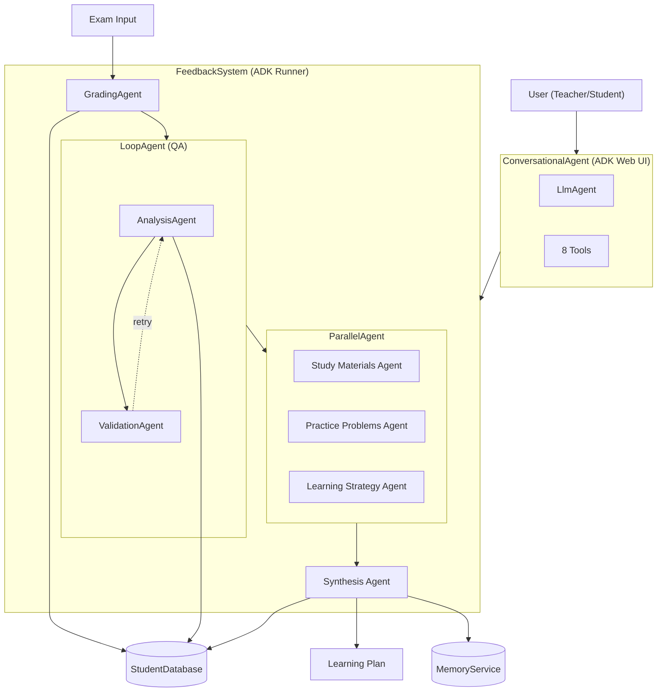

# System Architecture

**Project**: AI Agent Capstone - LearnPath Agent (Exam Correction System)
**Version**: 2.0
**Last Updated**: 2025-11-26

---

## Table of Contents

1. [System Overview](#system-overview)
2. [Architecture Principles](#architecture-principles)
3. [High-Level Architecture](#high-level-architecture)
4. [Core Components](#core-components)
5. [Agent Pipeline](#agent-pipeline)
6. [Conversational Interface](#conversational-interface)
7. [Data Flow](#data-flow)
8. [Authentication & Authorization](#authentication--authorization)
9. [Observability](#observability)
10. [Evaluation Framework](#evaluation-framework)
11. [Technology Stack](#technology-stack)
12. [Design Decisions](#design-decisions)
13. [Future Enhancements](#future-enhancements)

---

## System Overview

### Purpose

The Feedback System is an AI-powered exam correction and learning assistance platform that:
- Automatically grades student exams
- Identifies conceptual weaknesses
- Generates personalized learning recommendations
- Provides role-based access control for students and teachers
- Tracks performance metrics over time

### Key Goals

1. **Demonstrate ADK Best Practices**: Showcase proper use of Google Agent Development Kit patterns from the Kaggle AI Agents course
2. **Production-Ready Architecture**: Implement observability, evaluation, and proper state management
3. **Multimodal Support**: Process both text and image-based exams
4. **Educational Value**: Provide actionable feedback to improve student learning outcomes

---

## Architecture Principles

### 1. ADK-First Design

Every architectural decision follows Google ADK patterns:
- Runner for orchestration
- SessionService for state persistence
- Sequential agents with output_key pattern
- Proper plugin system integration

### 2. Separation of Concerns

Each component has a single, well-defined responsibility:
- **GradingAgent**: Exam scoring only
- **AnalysisAgent**: Weakness identification only
- **ValidationAgent**: Quality assurance only
- **ParallelAgent**: Concurrent recommendation generation
  - **Study Materials Agent**: Learning resources only
  - **Practice Problems Agent**: Exercise generation only
  - **Learning Strategy Agent**: Study techniques only
- **SynthesisAgent**: Unified learning plan creation only
- **Database**: Persistence only
- **Plugins**: Metrics and logging only

### 3. Stateless Operations

Agents are stateless; all state flows through SessionService:
- Initial exam data in session state
- Agent outputs via `output_key`
- Next agent reads from state placeholders

### 4. Async-First

All I/O operations use async/await:
- Agent execution
- Database operations
- Plugin callbacks
- API calls

---

## High-Level Architecture



### Component Overview

```
┌──────────────────────────────────────────────────────────────────────┐
│                        FeedbackSystem                                 │
│  ┌────────────────────────────────────────────────────────────────┐  │
│  │                          Runner                                 │  │
│  │  ┌──────────────────────────────────────────────────────────┐  │  │
│  │  │               Hybrid Agent Pipeline                       │  │  │
│  │  │                                                           │  │  │
│  │  │   1. GradingAgent (Sequential)                           │  │  │
│  │  │      output_key: grading_result                          │  │  │
│  │  │                     ↓                                     │  │  │
│  │  │   2. LoopAgent (Quality Assurance)                       │  │  │
│  │  │      ┌─────────────────────────────────────┐             │  │  │
│  │  │      │ AnalysisAgent → ValidationAgent    │             │  │  │
│  │  │      │ (retry up to 5x if validation fails)│             │  │  │
│  │  │      └─────────────────────────────────────┘             │  │  │
│  │  │      output_key: weakness_analysis                       │  │  │
│  │  │                     ↓                                     │  │  │
│  │  │   3. ParallelAgent (3 Recommenders)                      │  │  │
│  │  │      ┌──────────┬──────────┬──────────┐                  │  │  │
│  │  │      │ Study    │ Practice │ Learning │                  │  │  │
│  │  │      │ Materials│ Problems │ Strategy │                  │  │  │
│  │  │      └──────────┴──────────┴──────────┘                  │  │  │
│  │  │                     ↓                                     │  │  │
│  │  │   4. SynthesisAgent                                      │  │  │
│  │  │      output_key: learning_plan                           │  │  │
│  │  │                                                           │  │  │
│  │  └──────────────────────────────────────────────────────────┘  │  │
│  │                                                                 │  │
│  │   Plugins:                                                      │  │
│  │   - LoggingPlugin (ADK built-in)                               │  │
│  │   - ExamMetricsPlugin (custom domain metrics)                  │  │
│  └────────────────────────────────────────────────────────────────┘  │
│                                                                       │
│   SessionService (DatabaseSessionService or InMemorySessionService)  │
│   StudentDatabase (SQLite) + MemoryService (cross-session tracking)  │
└──────────────────────────────────────────────────────────────────────┘

External Systems:
┌─────────────────┐    ┌─────────────────┐
│  Google Gemini  │    │  ADK Web UI     │
│  API (1.5-flash)│    │  (localhost:8000)│
└─────────────────┘    └─────────────────┘
```

---

## Core Components

### 1. FeedbackSystem

**Location**: `feedback_agent/agent.py`

**Responsibilities**:
- System initialization and configuration
- Agent pipeline construction
- Plugin registration
- Session management
- Database integration

**Key Methods**:
```python
__init__(db_path, session_db_url, use_memory_sessions, enable_metrics)
register_student(name) -> student_id
process_exam(student_id, exam_content, answer_key, subject) -> results
get_metrics_summary() -> dict
```

**Configuration Options**:
- `db_path`: Student/exam database location (default: `data/students.db`)
- `session_db_url`: Session storage (default: `sqlite:///data/feedback_sessions.db`)
- `use_memory_sessions`: Use in-memory sessions (testing only)
- `enable_metrics`: Enable ExamMetricsPlugin
- `metrics_file`: Metrics output file path

### 2. Agent Pipeline

#### GradingAgent

**Location**: `feedback_agent/agents/grading_agent.py`

**Purpose**: Score student exams against answer keys

**Input**:
- `{exam_content}`: Student's answers
- `{answer_key}`: Correct answers

**Output**:
- `output_key`: "grading_result"
- Format: JSON with total_score, max_score, corrections, feedback

**Model**: gemini-2.0-flash (configurable via MODEL_NAME env var)

**Callback**: `_log_grading_callback` - Saves scores to database

#### LoopAgent (Quality Assurance)

**Location**: `feedback_agent/agent.py`

**Purpose**: Ensure high-quality analysis through validation and retry

**Contains**:
- **AnalysisAgent**: Identifies conceptual weaknesses
- **ValidationAgent**: Validates analysis quality

**Max Iterations**: 5 (retries until validation passes)

##### AnalysisAgent

**Location**: `feedback_agent/agents/analysis_agent.py`

**Purpose**: Identify conceptual weaknesses (not question text)

**Input**:
- `{exam_content}`: Original exam questions
- `{grading_result}`: Grading output from previous agent

**Output**:
- `output_key`: "weakness_analysis"
- Format: JSON with weaknesses (topic, description, severity), topics, summary

**Critical Feature**: Extracts underlying CONCEPTS, not question text
- ✅ "Newton's Second Law" (concept)
- ❌ "Calculate force when mass=10kg..." (question text)

**Callback**: `_log_analysis_callback` - Saves weaknesses to database

##### ValidationAgent

**Location**: `feedback_agent/agent.py`

**Purpose**: Validate analysis quality before proceeding

**Validation Checks**:
- `topics` field exists and is non-empty
- Weaknesses contain concept names, not question text
- Summary is substantive (>20 characters)

**Behavior**:
- If validation fails: Returns without escalate (triggers retry)
- If validation passes: Yields `Event(actions=EventActions(escalate=True))`

```python
class ValidationAgent(BaseAgent):
    async def _run_async_impl(self, ctx):
        analysis = ctx.session.state.get("weakness_analysis", {})

        # Validate topics field
        if not analysis.get("topics"):
            return  # Causes retry

        # Validation passed - escalate to proceed
        yield Event(actions=EventActions(escalate=True))
```

#### ParallelAgent (Recommendations)

**Location**: `feedback_agent/agent.py`

**Purpose**: Generate comprehensive recommendations efficiently

**Contains 3 specialized agents running concurrently**:

##### Study Materials Agent
- **Purpose**: Curate relevant learning resources
- **Output**: Textbooks, videos, articles matched to weaknesses
- **output_key**: "study_materials"

##### Practice Problems Agent
- **Purpose**: Generate targeted practice exercises
- **Output**: Problems addressing specific weak concepts
- **output_key**: "practice_problems"

##### Learning Strategy Agent
- **Purpose**: Develop personalized study techniques
- **Output**: Time management, review schedules
- **output_key**: "learning_strategy"

**Benefit**: All three agents execute simultaneously, reducing total processing time

#### SynthesisAgent

**Location**: `feedback_agent/agent.py`

**Purpose**: Combine parallel outputs into unified learning plan

**Input**:
- `{study_materials}`: From Study Materials Agent
- `{practice_problems}`: From Practice Problems Agent
- `{learning_strategy}`: From Learning Strategy Agent
- `{weakness_analysis}`: From LoopAgent

**Output**:
- `output_key`: "learning_plan"
- Format: JSON with learning_objectives, weekly_schedule, resources, success_metrics

**Callback**: `_log_recommendation_callback` - Saves combined recommendations to database

### 3. SessionService

**Two Implementations Based on Context**:

#### DatabaseSessionService (SQLite) - Exam Processing Pipeline

**Used by**: `FeedbackSystem` for exam grading and analysis

**Responsibilities**:
- Persist session state across invocations
- Store conversation events
- Enable context compaction
- Support session resumption

**Storage Schema**:
```sql
sessions(
    id TEXT PRIMARY KEY,
    app_name TEXT,
    user_id TEXT,
    state JSON,
    events JSON,
    last_update_time TIMESTAMP
)
```

#### InMemorySessionService - Conversational Interface

**Used by**: `get_feedback_system()` singleton for ADK Web UI

**Why InMemorySessionService for Conversational Tools**:
- Avoids async SQLite driver conflicts in ADK Web UI context
- Simpler state management for conversational flow
- Each conversation is independent (no persistence needed)

```python
def get_feedback_system() -> FeedbackSystem:
    """Singleton for conversational tools - uses InMemorySessionService."""
    return FeedbackSystem(use_memory_sessions=True)
```

### 4. Database Layer

**Location**: `feedback_agent/database.py`

**Schema**:

```sql
-- Students
students(
    student_id TEXT PRIMARY KEY,
    name TEXT,
    created_at TIMESTAMP
)

-- Exams
exams(
    exam_id TEXT PRIMARY KEY,
    student_id TEXT,
    subject TEXT,
    total_score REAL,
    max_score REAL,
    exam_date TIMESTAMP,
    FOREIGN KEY(student_id) REFERENCES students(student_id)
)

-- Analysis
analysis(
    analysis_id INTEGER PRIMARY KEY,
    exam_id TEXT,
    weaknesses JSON,
    recommendations TEXT,
    analysis_date TIMESTAMP,
    FOREIGN KEY(exam_id) REFERENCES exams(exam_id)
)
```

**Key Methods**:
- `add_student(student_id, name)`
- `log_exam(exam_id, student_id, subject, total_score, max_score)`
- `log_analysis(exam_id, weaknesses, recommendations)`
- `get_exam(exam_id)` - Returns complete exam with analysis
- `get_student_performance(student_id)` - All exams for student

### 5. Image Processing

**Location**: `feedback_agent/agents/image_processing_agent.py`

**Purpose**: Extract exam content from images

**Approach**: Direct Gemini API calls (stateless operation)

**Supported Formats**: PNG, JPEG, GIF, WebP

**Process**:
1. Load image file or bytes
2. Detect MIME type
3. Call Gemini vision model (gemini-2.5-pro)
4. Extract structured JSON (subject, exam_content, answer_key)

**Why Not Runner Pattern**: Simple stateless operation doesn't need session management

---

## Agent Pipeline

### State Flow Diagram

```
Initial State:
{
    "exam_id": "uuid",
    "student_id": "uuid",
    "subject": "Mathematics",
    "exam_content": "1. What is 2+2? Answer: 4\n...",
    "answer_key": "1. 4\n2. 15\n..."
}
                    ↓
        ┌───────────────────────┐
        │   GradingAgent        │
        │   reads: exam_content │
        │          answer_key   │
        └───────────────────────┘
                    ↓
State Update: + "grading_result"
                    ↓
        ┌───────────────────────────────────────┐
        │   LoopAgent (max 5 iterations)        │
        │   ┌─────────────────────────────┐     │
        │   │ AnalysisAgent               │     │
        │   │ reads: exam_content,        │     │
        │   │        grading_result       │     │
        │   └─────────────────────────────┘     │
        │                 ↓                     │
        │   ┌─────────────────────────────┐     │
        │   │ ValidationAgent             │     │
        │   │ checks: topics field,       │     │
        │   │         weakness quality    │     │
        │   │ fail → retry, pass → escalate    │
        │   └─────────────────────────────┘     │
        └───────────────────────────────────────┘
                    ↓
State Update: + "weakness_analysis"
                    ↓
        ┌───────────────────────────────────────┐
        │   ParallelAgent (concurrent)          │
        │   ┌─────────┬─────────┬─────────┐    │
        │   │ Study   │Practice │Learning │    │
        │   │Materials│Problems │Strategy │    │
        │   └─────────┴─────────┴─────────┘    │
        └───────────────────────────────────────┘
                    ↓
State Update: + "study_materials", "practice_problems", "learning_strategy"
                    ↓
        ┌───────────────────────┐
        │   SynthesisAgent      │
        │   reads: all parallel │
        │          outputs      │
        └───────────────────────┘
                    ↓
Final State: + "learning_plan"
```

### Communication Pattern

Agents communicate via **state placeholders** in instructions:

```python
# GradingAgent instruction
"""
Exam content: {exam_content}
Answer key: {answer_key}
...
"""

# AnalysisAgent instruction
"""
Input from state:
1. ORIGINAL EXAM CONTENT: {exam_content}
2. GRADING RESULTS: {grading_result}
...
"""

# SynthesisAgent instruction
"""
Combine into unified learning plan:
- Study materials: {study_materials}
- Practice problems: {practice_problems}
- Learning strategy: {learning_strategy}
...
"""
```

**Key Pattern**: `output_key` → next agent's placeholder

---

## Conversational Interface

### Overview

The conversational interface provides natural language interaction via ADK Web UI, allowing teachers and students to interact with the FeedbackSystem through chat.

**Location**: `feedback_agent/conversational_agent.py`, `feedback_agent/conversational_tools.py`

### Architecture

```
┌─────────────────────────────────────────────────────────┐
│                    ADK Web UI                            │
│                  (localhost:8000)                        │
└────────────────────────┬────────────────────────────────┘
                         │
                         ↓
┌─────────────────────────────────────────────────────────┐
│              Conversational Agent (LlmAgent)            │
│                                                         │
│  System Instruction:                                    │
│  - Authenticate users first                             │
│  - Route to appropriate tools based on role             │
│  - Format results for human readability                 │
│                                                         │
│  8 Tools:                                               │
│  ┌─────────────────┬───────────────────────────────┐   │
│  │ authenticate_user │ Login with name + role       │   │
│  │ process_exam_from_image │ Grade from image      │   │
│  │ process_exam_from_text │ Grade from text        │   │
│  │ get_my_results │ Student's own results          │   │
│  │ get_student_results │ Any student (teacher)     │   │
│  │ get_class_analytics │ Class statistics          │   │
│  │ list_students │ All registered students         │   │
│  │ get_learning_recommendations │ Study plan       │   │
│  └─────────────────┴───────────────────────────────┘   │
└────────────────────────┬────────────────────────────────┘
                         │
                         ↓
┌─────────────────────────────────────────────────────────┐
│              FeedbackSystem (Backend)                    │
│              (InMemorySessionService)                    │
└─────────────────────────────────────────────────────────┘
```

### Tools Detail

| Tool | Role | Description |
|------|------|-------------|
| `authenticate_user` | All | Login with name and role (teacher/student) |
| `process_exam_from_image` | Teacher | Grade an exam from uploaded image |
| `process_exam_from_text` | Teacher | Grade an exam from text content |
| `get_my_results` | All | View own exam results |
| `get_student_results` | Teacher | View any student's results |
| `get_class_analytics` | Teacher | View class-wide statistics |
| `list_students` | Teacher | List all registered students |
| `get_learning_recommendations` | All | Get personalized learning recommendations |

### Image Handling

The conversational interface supports multiple image sources with fallback:

```python
async def process_exam_from_image(ctx: ToolContext, ...):
    # Priority 1: ADK Web UI uploaded images
    image_bytes = extract_image_from_user_content(ctx)
    if image_bytes:
        return await process_image(image_bytes, ...)

    # Priority 2: URL-based images
    if image_path.startswith(("http://", "https://")):
        image_bytes = await fetch_image_from_url(image_path)
        return await process_image(image_bytes, ...)

    # Priority 3: Local file path
    if os.path.exists(image_path):
        return await process_image_from_file(image_path, ...)
```

**Supported Formats**: PNG, JPEG, GIF, WebP

### Role-Based Access

**Teachers can**:
- Grade exams from images or text
- View any student's results
- See class-wide analytics
- List all students
- Get learning recommendations for any student

**Students can**:
- View their own results only
- Get their own learning recommendations

---

## Data Flow

### Exam Processing Flow

```
1. User Input
   ├─ student_id
   ├─ exam_content (text or image)
   ├─ answer_key
   └─ subject

2. FeedbackSystem.process_exam()
   ├─ Generate exam_id
   ├─ Create session with initial state
   └─ Trigger Runner

3. Runner.run_async()
   ├─ before_run_callback (metrics tracking)
   ├─ Execute Hybrid Agent Pipeline
   │  │
   │  ├─ GradingAgent (Sequential)
   │  │  ├─ LLM call (Gemini)
   │  │  ├─ Update state: grading_result
   │  │  └─ DB callback: log_exam()
   │  │
   │  ├─ LoopAgent (Quality Assurance, max 5 iterations)
   │  │  ├─ AnalysisAgent
   │  │  │  ├─ LLM call
   │  │  │  └─ Update state: weakness_analysis
   │  │  └─ ValidationAgent
   │  │     ├─ Validate topics field exists
   │  │     ├─ Validate weakness quality
   │  │     └─ escalate=True on pass, retry on fail
   │  │  └─ DB callback: log_analysis()
   │  │
   │  ├─ ParallelAgent (3 Recommenders - concurrent)
   │  │  ├─ Study Materials Agent → study_materials
   │  │  ├─ Practice Problems Agent → practice_problems
   │  │  └─ Learning Strategy Agent → learning_strategy
   │  │
   │  └─ SynthesisAgent
   │     ├─ LLM call (combines parallel outputs)
   │     ├─ Update state: learning_plan
   │     └─ DB callback: log_recommendation()
   │
   └─ after_run_callback (metrics finalization)

4. Session State Persisted
   └─ SessionService.update_session()

5. Memory Service Update
   └─ Track cross-session patterns

6. Results Retrieved
   ├─ Fetch from StudentDatabase
   └─ Return formatted results
```

### Database Write Flow

```
GradingAgent Callback:
    ↓
Parse grading_result JSON
    ↓
StudentDatabase.log_exam()
    ↓
INSERT INTO exams (exam_id, student_id, subject, total_score, max_score, exam_date)

AnalysisAgent Callback:
    ↓
Parse weakness_analysis JSON
    ↓
StudentDatabase.log_analysis()
    ↓
INSERT INTO analysis (exam_id, weaknesses, analysis_date)

RecommendationAgent Callback:
    ↓
Parse learning_plan JSON
    ↓
StudentDatabase.log_analysis() [update recommendations]
    ↓
UPDATE analysis SET recommendations = ? WHERE exam_id = ?
```

---

## Authentication & Authorization

### Authentication System

**Location**: `feedback_agent/auth.py`

**Architecture**: Session-based authentication (simple, suitable for capstone)

**Components**:

1. **User Model**:
```python
@dataclass
class User:
    user_id: str
    name: str
    role: UserRole  # STUDENT, TEACHER, ADMIN
    created_at: datetime
```

2. **Session Model**:
```python
@dataclass
class UserSession:
    session_id: str
    user_id: str
    created_at: datetime
    expires_at: datetime
```

3. **AuthenticationService**:
- `register_user(user_id, name, role)` - Create user
- `login(user_id)` - Create session
- `validate_session(session_id)` - Check if valid
- `get_user_from_session(session_id)` - Retrieve user

**Session Storage**: In-memory dictionary (production would use Redis/database)

**Session Expiration**: 24 hours (configurable)

### Authorization Layer

**Location**: `feedback_agent/authorization.py`

**Pattern**: ADK tools with ToolContext

**Role Hierarchy**:
```
ADMIN (highest privileges)
  ↓
TEACHER (can view all students)
  ↓
STUDENT (can only view own data)
```

**Authorization Tools**:

1. **get_my_performance(tool_context)**
   - Permission: Any authenticated user
   - Returns: User's own exam performance
   - Use case: Student dashboard

2. **get_student_performance(tool_context, student_id)**
   - Permission: TEACHER or ADMIN only
   - Returns: Specific student's performance
   - Use case: Teacher reviewing student progress

3. **get_class_statistics(tool_context)**
   - Permission: TEACHER or ADMIN only
   - Returns: Class-wide statistics
   - Use case: Teacher dashboard

4. **list_my_students(tool_context)**
   - Permission: TEACHER or ADMIN only
   - Returns: All students in system
   - Use case: Teacher class roster

**Permission Checking Pattern**:
```python
async def get_student_performance(tool_context: ToolContext, student_id: str):
    # 1. Validate session
    user = auth_service.get_user_from_session(tool_context.session_id)
    if not user:
        raise PermissionError("Unauthenticated")

    # 2. Check role
    if user.role not in [UserRole.TEACHER, UserRole.ADMIN]:
        raise PermissionError("Insufficient permissions")

    # 3. Execute action
    return db.get_student_performance(student_id)
```

---

## Observability

### Architecture

**Dual-Layer Approach**:

1. **ADK LoggingPlugin** (Built-in)
   - Purpose: Agent lifecycle logging
   - Logs: Invocation start/end, agent execution, LLM requests/responses, token usage
   - Output: Console with color-coded events

2. **ExamMetricsPlugin** (Custom)
   - Purpose: Domain-specific metrics
   - Logs: Processing times, scores, success rates, agent timings
   - Output: JSONL file + in-memory aggregation

### Plugin System

**Location**: `feedback_agent/plugins.py`

**Base Class**: `google.adk.plugins.BasePlugin`

**Lifecycle Callbacks**:

```python
class ExamMetricsPlugin(BasePlugin):
    async def before_run_callback(self, **kwargs):
        """Called when exam processing starts"""
        invocation_context = kwargs.get('invocation_context')
        session_id = invocation_context.session.id
        # Start tracking metrics

    async def after_run_callback(self, **kwargs):
        """Called when exam processing completes"""
        # Calculate total duration
        # Extract results from state
        # Write metrics to file

    async def before_agent_callback(self, **kwargs):
        """Called when an agent starts"""
        agent_name = kwargs.get('agent_context').agent.name
        # Start agent timer

    async def after_agent_callback(self, **kwargs):
        """Called when an agent completes"""
        # Calculate agent duration
        # Store in session metrics
```

**Critical Patterns**:
- Plugins registered in `App`, not `Runner`
- All callbacks must be `async`
- Access state via `invocation_context.session.state`
- Access session ID via `invocation_context.session.id`

### Metrics Format

**JSONL Output** (`exam_metrics.jsonl`):
```jsonl
{
  "session_id": "exam_abc123",
  "exam_id": "uuid",
  "student_id": "uuid",
  "subject": "Mathematics",
  "start_time": 1700000000.0,
  "end_time": 1700000005.5,
  "start_timestamp": "2025-11-24T18:55:03.307",
  "end_timestamp": "2025-11-24T18:55:08.807",
  "total_duration": 5.5,
  "agent_timings": {
    "grading_agent": 2.0,
    "analysis_agent": 1.5,
    "recommendation_agent": 2.0
  },
  "total_score": 8.0,
  "max_score": 10.0,
  "percentage": 80.0,
  "weaknesses_count": 2,
  "weakness_severities": {
    "low": 1,
    "medium": 1,
    "high": 0
  },
  "status": "completed"
}
```

**Aggregated Statistics**:
```python
{
    "total_exams_processed": 100,
    "total_processing_time": 550.0,
    "avg_processing_time": 5.5,
    "avg_score_percentage": 78.5,
    "success_count": 98,
    "failure_count": 2,
    "success_rate": 0.98,
    "score_distribution": {
        "min": 45.0,
        "max": 100.0,
        "avg": 78.5
    }
}
```

### Structured Logging

**Configuration**:
```python
logging.basicConfig(
    level=logging.INFO,
    format='%(asctime)s - %(name)s - %(levelname)s - [%(filename)s:%(lineno)d] - %(message)s',
    handlers=[
        logging.StreamHandler(),  # Console
        logging.FileHandler('feedback_system.log', mode='a')  # File
    ]
)
```

**Log Examples**:
```
2025-11-24 18:55:03,307 - feedback_agent.plugins - INFO - 📊 Exam abc123 processed in 5.50s
2025-11-24 18:55:03,310 - feedback_agent.agent - INFO - ✅ Exam processing complete for abc123
```

---

## Evaluation Framework

### Architecture

**Location**: `evals/`

**Components**:

1. **Evaluation Dataset** (`evals/evalset.json`)
   - 8 test cases
   - Categories: grading_accuracy, analysis_quality, recommendation_relevance
   - Difficulty levels: easy, medium, hard
   - Ground truth data for comparison

2. **Metrics Module** (`evals/metrics.py`)
   - `GradingAccuracyMetric`: Score comparison (exact match, tolerance, percentage)
   - `AnalysisQualityMetric`: Topic coverage, weakness precision/recall
   - `RecommendationRelevanceMetric`: Coverage, specificity, alignment

3. **Evaluation Runner** (`evals/run_evaluation.py`)
   - Async test execution
   - Results aggregation
   - JSON output with timestamps

### Evaluation Flow

```
1. Load Test Cases
   └─ evals/evalset.json

2. For Each Test Case:
   ├─ Execute FeedbackSystem.process_exam()
   ├─ Extract results (scores, weaknesses, recommendations)
   ├─ Compare with ground truth
   │  ├─ GradingAccuracyMetric
   │  ├─ AnalysisQualityMetric
   │  └─ RecommendationRelevanceMetric
   └─ Calculate pass/fail (threshold: 0.70)

3. Aggregate Results:
   ├─ Overall score (weighted: 40% grading, 35% analysis, 25% recommendations)
   ├─ Pass rate by category
   ├─ Pass rate by difficulty
   └─ Detailed failure analysis

4. Generate Report:
   └─ evals/results/evaluation_results_TIMESTAMP.json
```

### Metrics Calculation

**Grading Accuracy**:
```python
exact_match = (actual_score == expected_score)
tolerance_match = abs(actual_score - expected_score) <= tolerance
percentage_accuracy = 1.0 - abs(actual_pct - expected_pct) / 100.0
```

**Analysis Quality**:
```python
topic_coverage = len(identified_topics ∩ expected_topics) / len(expected_topics)
weakness_precision = true_positives / (true_positives + false_positives)
weakness_recall = true_positives / (true_positives + false_negatives)
```

**Recommendation Relevance**:
```python
coverage = recommendations_count / weaknesses_count
specificity = topic_mentions / total_recommendations
alignment = matching_recommendations / expected_recommendations
```

### Current Performance

- **Pass Rate**: 25% (2/8 tests)
- **Grading Accuracy**: 0.550
- **Analysis Quality**: 0.233 (⚠️ needs improvement)
- **Recommendation Relevance**: 0.892

**Known Issue**: gemini-2.0-flash insufficient for complex concept extraction. Upgrade to gemini-1.5-pro recommended.

---

## Technology Stack

### Core Framework

- **Google Agent Development Kit (ADK)**: 1.18.0+
  - Runner pattern for orchestration
  - SessionService for persistence
  - Plugin system for extensibility
  - Built-in logging and metrics

### LLM Backend

- **Google Gemini API**:
  - Primary model: `gemini-2.0-flash` (15 req/min)
  - Vision model: `gemini-2.5-pro` (multimodal)
  - Alternative: `gemini-1.5-pro` (2 req/min, higher quality)
  - Configurable via `MODEL_NAME` environment variable

### Data Storage

- **SQLite**:
  - Student/exam database (`data/students.db`)
  - Session storage (`data/feedback_sessions.db`)
  - Metrics cache (in-memory + JSONL file)
  - All database files organized in `data/` directory

### Development Tools

- **Python**: 3.13+
- **uv**: Dependency manager (modern pip alternative)
- **pytest**: Testing framework
- **python-dotenv**: Environment configuration

### Async Runtime

- **asyncio**: Python async/await
- **aiohttp**: Async HTTP client (Gemini API)

---

## Design Decisions

### ADR Index

1. [ADR-001: Migrate to ADK Runner Pattern](./adr/001-migrate-to-adk-runner-pattern.md)
   - Why: Custom run_agent() fights ADK patterns
   - Impact: 35% codebase refactor, unlocks proper state management

2. [ADR-002: Agent State Flow Pattern](./adr/002-agent-state-flow-pattern.md)
   - Why: Clear communication between agents
   - Impact: output_key → state placeholders

3. [ADR-003: Session-Based Authentication](./adr/003-session-based-authentication.md)
   - Why: Simple, suitable for capstone scope
   - Impact: In-memory sessions (production would use Redis)

4. [ADR-004: Model Configuration Strategy](./adr/004-model-configuration.md)
   - Why: Flexible model selection for rate limits
   - Impact: Environment-based MODEL_NAME configuration

5. [ADR-005: AnalysisAgent Architecture Fix](./adr/005-analysis-agent-fix.md)
   - Why: Agent needs exam_content for concept extraction
   - Impact: Improved topic coverage from 0% to 25%

6. [ADR-006: Observability with Custom Plugin](./adr/006-observability-with-custom-plugin.md)
   - Why: Domain-specific metrics beyond basic logging
   - Impact: Production-ready monitoring system

### Key Architectural Choices

#### Why Hybrid Agent Pipeline?

**Decision**: Use Sequential + Loop + Parallel agents instead of pure sequential

**Rationale**:
- **Sequential for dependencies**: Grading → Analysis → Recommendations must run in order
- **LoopAgent for quality**: ValidationAgent ensures analysis quality before proceeding
- **ParallelAgent for efficiency**: 3 recommendation agents run concurrently
- **SynthesisAgent for coherence**: Combines parallel outputs into unified plan

**Benefits**:
- Quality assurance through validation loops (up to 5 retries)
- Faster recommendation generation (3 agents in parallel)
- Unified learning plan from diverse recommendation sources
- Clear separation of concerns

**Trade-off**: More complex pipeline, but better output quality and efficiency

#### Why Two SessionService Implementations?

**Decision**: DatabaseSessionService for exam processing, InMemorySessionService for conversational tools

**Rationale**:

**DatabaseSessionService (exam processing)**:
- Session resumption after crashes
- Audit trail of exam processing
- Context compaction requires history
- Production-ready pattern

**InMemorySessionService (conversational interface)**:
- Avoids async SQLite driver conflicts in ADK Web UI context
- Simpler state management for chat flow
- Each conversation is independent (no persistence needed)
- Better compatibility with ADK Web UI

**Trade-off**: Conversational sessions are not persisted, but this is acceptable for chat interactions

#### Why Direct API Calls for Image Processing?

**Decision**: Use direct Gemini API instead of Runner pattern

**Rationale**:
- Stateless operation (no conversation history needed)
- Simpler error handling
- Faster execution (no session overhead)
- Clear separation of concerns

**Trade-off**: Cannot use plugins/callbacks for image processing, but not needed

#### Why JSONL for Metrics?

**Decision**: Write metrics to JSON Lines format

**Rationale**:
- Human-readable
- Easy to parse (one JSON per line)
- Append-only (no locking issues)
- Compatible with log analysis tools
- No schema migrations

**Trade-off**: Less efficient than binary format, but sufficient for capstone scale

---

## Future Enhancements

### Already Implemented

**MemoryService** (Cross-session learning progression tracking):
- `get_recurring_weaknesses(student_id)`: Identifies persistent learning gaps
- `get_learning_velocity(student_id)`: Measures improvement rate over time
- `recommend_review_topics(student_id)`: Suggests topics for spaced repetition

**Conversational Interface**:
- ADK Web UI integration
- 8 tools for natural language interaction
- Role-based authentication (teacher/student)
- Image upload support

**Hybrid Pipeline**:
- LoopAgent with ValidationAgent for quality assurance
- ParallelAgent for concurrent recommendation generation
- SynthesisAgent for unified learning plans

### Production Enhancements

1. **Distributed Tracing**: OpenTelemetry integration
2. **Metrics Dashboard**: Grafana + Prometheus
3. **Rate Limiting**: Redis-based request throttling
4. **Caching Layer**: Cache common weakness patterns
5. **Multi-tenant**: Support multiple schools/organizations
6. **Real-time Updates**: WebSocket for live feedback
7. **Model A/B Testing**: Compare different LLM configurations
8. **Explainability**: Show which exam questions led to weakness identification

### Scalability Improvements

1. **Horizontal Scaling**:
   - Stateless agent design enables load balancing
   - Session storage in shared database (PostgreSQL)
   - Metrics aggregation in time-series database

2. **Async Batching**:
   - Process multiple exams concurrently
   - Batch LLM requests for efficiency
   - Queue-based workload distribution

3. **Caching Strategy**:
   - Cache common answer patterns
   - Memoize weakness taxonomies
   - Cache recommendation templates

---

## Appendix

### Environment Variables

```bash
# LLM Configuration
GOOGLE_GENAI_USE_VERTEXAI=0
GOOGLE_GEMINI_BASE_URL="https://generativelanguage.googleapis.com"
GOOGLE_API_KEY=your_api_key_here
MODEL_NAME="gemini-2.0-flash"  # or gemini-1.5-pro, gemini-2.5-pro

# Database Paths
STUDENT_DB_PATH="data/students.db"
SESSION_DB_URL="sqlite:///data/feedback_sessions.db"

# Metrics
METRICS_ENABLED=true
METRICS_FILE="exam_metrics.jsonl"
```

### Directory Structure

```
ai_agent_capstone/
├── .adr/                          # Architecture Decision Records
├── data/                          # Runtime database files
│   ├── students.db                # Student/exam database
│   ├── feedback_sessions.db       # ADK session storage
│   └── *.db                       # Test databases
├── feedback_agent/
│   ├── agents/
│   │   ├── grading_agent.py       # Exam scoring
│   │   ├── analysis_agent.py      # Weakness identification
│   │   ├── recommendation_agent.py # Learning recommendations
│   │   └── image_processing_agent.py # Image extraction
│   ├── agent.py                   # Main FeedbackSystem + pipeline
│   ├── conversational_agent.py    # ADK Web UI conversational agent
│   ├── conversational_tools.py    # 8 tools for conversational interface
│   ├── auth.py                    # Authentication
│   ├── authorization.py           # Authorization tools
│   ├── database.py                # Data persistence
│   ├── memory.py                  # Cross-session tracking
│   ├── plugins.py                 # Custom metrics plugin
│   └── custom_llm.py              # Gemini wrapper
├── evals/
│   ├── evalset.json               # Test cases
│   ├── metrics.py                 # Evaluation metrics
│   ├── run_evaluation.py          # Evaluation runner
│   └── results/                   # Evaluation outputs
├── tests/
│   ├── test_authorization.py
│   ├── test_image_processing.py
│   ├── test_observability.py
│   ├── test_memory.py
│   └── test_refactored_agent.py
├── docs/
│   ├── ARCHITECTURE.md            # This document
│   ├── CAPSTONE_REPORT.md         # Project report
│   └── HOW-TO-USE.md              # User guide
├── README.md                      # Project overview
├── demo.py                        # Interactive demo
└── pyproject.toml                 # Dependencies
```

---

**Document Version**: 2.0
**Author**: Development Team
**Last Review**: 2025-11-26
